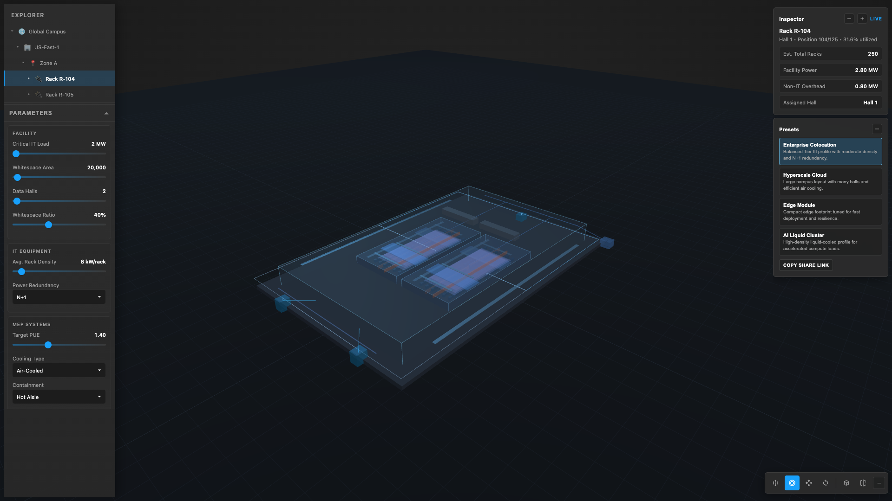

# DC Simulator

Parameter-driven data center visualization sandbox with a Next.js dashboard, typed global state, and an interactive viewport.

Live deployment: [dc-simulator-omega.vercel.app](https://dc-simulator-omega.vercel.app)

[](https://nextjs.org/)
[](https://react.dev/)
[](https://www.typescriptlang.org/)
[](roadmap.md)



## What it does

- Provides a dark-canvas sandbox UI for exploring data center entities with rack, hall, and building selection.
- Exposes key facility, IT, and MEP parameters through sliders/dropdowns with immediate state updates.
- Uses industry-aligned data center terminology (critical load, PUE, redundancy, containment).
- Keeps model-facing inputs typed and centralized via a React Context + reducer store.
- Includes cutaway mode, scenario presets, and copyable URL state for reproducible views.
- Adds mobile-friendly overlay behavior with quick panel toggles and one-tap "minimize all" UI controls.
- Maintains a deployment-friendly Next.js setup with standard build/start commands.

## Architecture

```text
Next.js App Router page (/)
  -> StoreProvider (typed app state)
  -> ExplorerTree + ParamDrawer + SpecsPanel + BottomControls
  -> Viewport (Three.js procedural building, halls, instanced racks, overlays, thermal layers, cutaway, and scroll/orbit/pan camera controls)
```

## Repository layout

```text
dc-simulator/
├── app/
│   ├── Providers.tsx
│   ├── globals.css
│   ├── layout.tsx
│   └── page.tsx
├── docs/
│   └── screenshots/
├── src/
│   ├── model/
│   ├── scene/
│   │   └── Viewport.tsx
│   ├── state/
│   │   ├── actions.ts
│   │   ├── index.ts
│   │   ├── presets.ts
│   │   ├── reducer.ts
│   │   ├── store.tsx
│   │   ├── types.ts
│   │   └── urlState.ts
│   └── ui/
│       ├── BottomControls.tsx
│       ├── Dropdown.tsx
│       ├── ExplorerTree.tsx
│       ├── IconButton.tsx
│       ├── InputField.tsx
│       ├── ParamDrawer.tsx
│       ├── PresetsPanel.tsx
│       ├── Slider.tsx
│       ├── SpecsPanel.tsx
│       └── TreeItem.tsx
├── AGENTS.md
├── errors.md
├── roadmap.md
└── README.md
```

## Prerequisites

- Node.js 18+
- npm 9+

## Quick start

```bash
git clone https://github.com/your-username/dc-simulator.git
cd dc-simulator
npm install
npm run dev
```

## Data center parameters

| Category | Parameter | Unit | Description |
|---|---|---|---|
| Facility | Critical IT Load | MW | Total IT equipment power |
| Facility | Whitespace Area | sq ft | IT whitespace footprint |
| Facility | Data Halls | count | Number of halls |
| Facility | Whitespace Ratio | % | Whitespace-to-total footprint ratio |
| IT Equipment | Avg. Rack Density | kW/rack | Average rack load |
| IT Equipment | Power Redundancy | N / N+1 / 2N | Infrastructure redundancy model |
| MEP Systems | Target PUE | ratio | Energy efficiency target |
| MEP Systems | Cooling Type | Air-Cooled / DLC / Hybrid | Primary cooling method |
| MEP Systems | Containment | None / Hot Aisle / Cold Aisle / Full Enclosure | Airflow strategy |

## Documentation map

- `roadmap.md`: ordered implementation prompts and execution status tags.
- `errors.md`: known issues, fixes, and lessons learned by category.
- `AGENTS.md`: contributor/agent rules for architecture, style, and deployability.

## Roadmap status

- Executed: Prompts 01-15.
- Pending: None in v0 roadmap.

## License

License file has not been added yet.

## Star tracker

[](https://star-history.com/#lordSauron1710/dc-simulator&Date)
